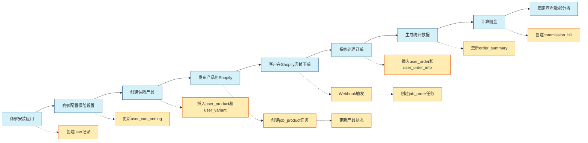

# Hope - Shopify 产品保险服务应用

## 📋 系统概述

Hope 是一个为 Shopify 商家提供**产品保险服务**的应用，允许商家在其店铺中销售保险产品，并跟踪相关的订单和收益数据。通过佣金模式盈利，为商家和消费者创造价值。

### 核心功能

- **保险产品管理**：创建和管理保险产品及其变体
- **购物车集成**：自定义保险产品在购物车中的展示方式
- **订单处理**：自动处理包含保险产品的订单
- **数据统计**：提供销售、收益和保险附加率等关键指标
- **佣金管理**：基于订单中的保险产品计算佣金

## 🏗️ 系统架构

Hope 采用现代化的微服务架构，主要由以下组件构成：

### 前端 (Frontend)

- **技术栈**：React + TypeScript + Vite
- **主要模块**：
  - 商家控制面板
  - 保险产品管理界面
  - 购物车设置界面
  - 订单管理界面
  - 数据统计仪表盘

### 后端 (Backend)

- **技术栈**：Go + Clean Architecture
- **架构分层**：
  - **应用层** (application)：实现业务用例和协调领域对象
  - **领域层** (domain)：包含业务逻辑和实体模型
  - **基础设施层** (infras)：提供技术实现和外部服务集成
  - **接口层** (interfaces)：处理外部请求和响应

### Shopify 集成

- **Shopify App**：通过 Shopify App Bridge 与 Shopify 商店集成
- **API 集成**：使用 Shopify GraphQL 和 REST API
- **Webhook**：接收订单创建、更新等事件通知

### 数据存储

- **主数据库**：MySQL (存储用户、产品、订单等核心数据)
- **缓存**：Redis (提高性能和支持分布式锁)

### 部署架构

- **容器化**：使用 Docker 和 Docker Compose 进行部署
- **Web 服务器**：Nginx 用于反向代理和静态资源服务
- **监控**：内置监控面板，跟踪系统性能和业务指标

## 🚀 快速开始

### 环境要求
- Docker & Docker Compose
- Git

### 1. 克隆项目
```bash
git clone <repository-url>
cd hope
```

### 2. 配置环境变量
```bash
# 复制环境变量模板
cp env.example .env

# 编辑 .env 文件，设置您的配置
# 重要：请修改默认密码！
```

### 3. 启动服务
```bash
# 开发环境
docker-compose up -d

# 生产环境（推荐）
docker-compose -f docker-compose.prod.yml up -d
```

### 4. 访问应用
- 前端应用：http://localhost
- API文档：http://localhost:8080
- 监控面板：http://localhost:8090

## 🔐 环境变量配置

本项目使用环境变量管理敏感配置信息。详细配置说明请查看 [ENV-README.md](./ENV-README.md)。

### 必需配置
- `DB_PASSWORD`: 数据库密码
- `REDIS_PASSWORD`: Redis密码
- `MYSQL_ROOT_PASSWORD`: MySQL root密码
- `SHOPIFY_API_KEY`: Shopify API 密钥
- `SHOPIFY_API_SECRET`: Shopify API 密钥

### 安全建议
1. 使用强密码
2. 生产环境使用 `docker-compose.prod.yml`
3. 定期更换密码
4. 不要将 `.env` 文件提交到版本控制

## 💰 订阅与计费模型

Hope 应用采用基于佣金的计费模型：

- **订阅管理**：通过 `user_subscription` 表管理商家的订阅信息
- **佣金计算**：基于保险产品销售额的百分比或固定金额
- **账单周期**：支持按月、按年或一次性计费
- **用量计费**：通过 Shopify Billing API 实现按使用量计费
- **统计报表**：提供详细的佣金和收益统计

## 🗂️ 表结构分析和数据存储时机

### 1. **用户管理模块**

#### `user` - 用户表
**存储内容**：Shopify 商家的基本信息
**数据来源时机**：
- 商家安装应用时创建
- Shopify OAuth 认证后获取店铺信息
- 商家首次登录时同步店铺数据

```sql
-- 商家安装应用时
INSERT INTO `user` (name, shop, access_token, email, country_name) 
VALUES ('Shop Name', 'shop-domain.myshopify.com', 'access-token', 'email@example.com', 'US');
```


### 2. **产品管理模块**

#### `user_product` - 保险产品表
**存储内容**：商家创建的保险产品
**数据来源时机**：
- 商家在应用中创建保险产品时
- 产品发布到 Shopify 时更新 `product_id` 和 `is_publish` 状态

#### `user_variant` - 产品变体表
**存储内容**：保险产品的不同规格/价格变体
**数据来源时机**：
- 创建产品时同时创建变体
- 发布到 Shopify 后更新 `variant_id`

#### `user_cart_setting` - 购物车配置表
**存储内容**：保险产品在购物车中的展示配置
**数据来源时机**：
- 商家配置保险产品展示方式时
- 设置价格计算规则、颜色、文案等

### 3. **订单处理模块**

#### `user_order` - 订单主表
**存储内容**：来自 Shopify 的订单信息
**数据来源时机**：
- **Webhook 触发**：Shopify 订单创建/更新时
- **定时同步**：定期拉取 Shopify 订单数据
- 包含保险金额计算结果

#### `user_order_info` - 订单详情表
**存储内容**：订单中每个商品的详细信息
**数据来源时机**：
- 处理订单时解析 line_items
- 标识哪些是保险产品 (`is_insurance`)

#### `order_summary` - 订单统计表
**存储内容**：按天聚合的订单统计数据
**数据来源时机**：
- **每日凌晨**：统计前一天的订单数据
- 计算销售额、保险收益、退款等

### 4. **任务队列模块**

#### `job_order` - 订单同步任务表
**存储内容**：订单同步任务的执行记录
**数据来源时机**：
- Shopify Webhook 接收到订单事件时创建任务
- 定时任务创建批量同步任务
- 记录处理状态和结果

#### `job_product` - 产品上传任务表
**存储内容**：产品发布到 Shopify 的任务记录
**数据来源时机**：
- 商家点击"发布到 Shopify"时创建任务
- 批量发布产品时创建多个任务

## 🔄 数据流向时序

### 系统流程图

```mermaid
flowchart TD
    %% 主要系统组件
    subgraph Frontend["前端 (React + TypeScript)"]
        MerchantDashboard["商家控制面板"]
        ProductManagement["保险产品管理"]
        CartSettings["购物车设置"]
        OrderManagement["订单管理"]
        Statistics["数据统计仪表盘"]
    end

    subgraph Backend["后端 (Go + Clean Architecture)"]
        subgraph Application["应用层"]
            AppServices["应用服务"]
            UseCases["业务用例"]
        end
        
        subgraph Domain["领域层"]
            Entities["实体模型"]
            BusinessLogic["业务逻辑"]
        end
        
        subgraph Infrastructure["基础设施层"]
            ExternalServices["外部服务集成"]
            Repositories["数据仓库"]
        end
        
        subgraph Interfaces["接口层"]
            WebHandlers["Web处理器"]
            APIControllers["API控制器"]
            Webhooks["Webhook处理"]
        end
    end

    subgraph ShopifyPlatform["Shopify平台"]
        ShopifyStore["商家店铺"]
        ShopifyAPI["Shopify API"]
        ShopifyWebhooks["Shopify Webhooks"]
        ShopifyBilling["Shopify Billing API"]
    end

    subgraph DataStorage["数据存储"]
        MySQL[(MySQL数据库)]
        Redis[(Redis缓存)]
    end

    %% 数据流向
    %% 1. 安装流程
    ShopifyStore -->|1. 安装应用| WebHandlers
    WebHandlers -->|OAuth认证| ShopifyAPI
    WebHandlers -->|2. 创建用户记录| Repositories
    Repositories -->|存储用户数据| MySQL
    
    %% 2. 配置保险设置
    MerchantDashboard -->|3. 配置保险设置| APIControllers
    APIControllers -->|调用业务逻辑| UseCases
    UseCases -->|更新设置| Repositories
    Repositories -->|存储设置| MySQL
    
    %% 3. 创建保险产品
    ProductManagement -->|4. 创建保险产品| APIControllers
    APIControllers -->|处理请求| UseCases
    UseCases -->|创建产品| Repositories
    Repositories -->|存储产品数据| MySQL
    
    %% 4. 发布产品
    ProductManagement -->|5. 发布产品| APIControllers
    APIControllers -->|创建任务| UseCases
    UseCases -->|添加到队列| Repositories
    Repositories -->|存储任务| MySQL
    ExternalServices -->|发布到Shopify| ShopifyAPI
    ShopifyAPI -->|产品创建成功| ExternalServices
    ExternalServices -->|更新状态| Repositories
    
    %% 5. 客户下单
    ShopifyStore -->|6. 客户购买保险| ShopifyWebhooks
    ShopifyWebhooks -->|订单事件| Webhooks
    Webhooks -->|创建订单任务| UseCases
    UseCases -->|添加到队列| Repositories
    Repositories -->|存储任务| MySQL
    
    %% 6. 处理订单
    ExternalServices -->|处理订单队列| Repositories
    Repositories -->|获取任务| MySQL
    ExternalServices -->|获取订单详情| ShopifyAPI
    ExternalServices -->|处理订单数据| BusinessLogic
    BusinessLogic -->|计算保险金额| Entities
    ExternalServices -->|存储订单| Repositories
    Repositories -->|保存订单数据| MySQL
    
    %% 7. 生成统计
    ExternalServices -->|7. 定时任务| BusinessLogic
    BusinessLogic -->|生成统计数据| Repositories
    Repositories -->|存储统计结果| MySQL
    Statistics -->|查询统计数据| APIControllers
    APIControllers -->|获取统计| Repositories
    
    %% 8. 佣金计算
    ExternalServices -->|计算佣金| BusinessLogic
    BusinessLogic -->|应用佣金规则| Entities
    ExternalServices -->|创建佣金记录| ShopifyBilling
    ShopifyBilling -->|佣金收取成功| ExternalServices
    ExternalServices -->|更新佣金状态| Repositories

    %% 缓存使用
    Repositories <-->|缓存数据| Redis
    
    %% 样式设置
    classDef frontend fill:#f9f,stroke:#333,stroke-width:2px;
    classDef backend fill:#bbf,stroke:#333,stroke-width:2px;
    classDef shopify fill:#bfb,stroke:#333,stroke-width:2px;
    classDef storage fill:#fbb,stroke:#333,stroke-width:2px;
    
    class Frontend frontend;
    class Backend,Application,Domain,Infrastructure,Interfaces backend;
    class ShopifyPlatform,ShopifyStore,ShopifyAPI,ShopifyWebhooks,ShopifyBilling shopify;
    class DataStorage,MySQL,Redis storage;
```



### 商家使用流程图



### 商家使用流程步骤：
1. **安装应用** → 创建 `user` 记录
2. **配置保险设置** → 更新 `user_cart_setting`
3. **创建保险产品** → 插入 `user_product` + `user_variant`
4. **发布产品** → 创建 `job_product` 任务 → 更新产品状态
5. **客户下单** → Webhook 触发 → 创建 `job_order` 任务
6. **处理订单** → 插入 `user_order` + `user_order_info`
7. **生成统计** → 每日更新 `order_summary`
8. **计算佣金** → 创建 `commission_bill` 记录
9. **数据分析** → 商家查看销售和收益数据

### 关键业务逻辑：
- **保险金额计算**：根据 `user_cart_setting` 中的定价规则计算保险费用
- **收益统计**：从订单中提取保险部分的收益进行统计
- **异步处理**：使用任务队列处理 Shopify API 调用，避免阻塞
- **数据同步**：定期与 Shopify 同步订单状态和产品信息

这是一个典型的 **SaaS 电商插件系统**，专注于为 Shopify 商家提供产品保险销售能力，通过佣金模式盈利。

### 待办清单
开启插件后,自动同步 7 天的单号,同步其中有购买保险的单号
1. orders 时间筛选抽离
    1. orders 顶部统计卡片
2. protection page 设置
    1. ~~checkbox 样式~~
    2. ~~demo 的佣金计算逻辑~~
    3. ~~demo 的跳转~~
    4. ~~product 删除后的图片异常问题~~
    5. ~~product 禁用发货设置~~
    6. ~~css样式设置~~
   
    7. 插件安装检测banner
    8. fulfillment 规则应用
    9. 佣金设置的默认值
    10. ~~佣金设置 other value的针对不同 type 的数据类型设置~~
    11. cart setting 插件设置应用
    12. ~~Footer link URL 在 demo 里的应用~~
3. ~~全局loading样式~~
4. dashboard 
   1. 图表样式
   2. 新人引导默认选中规则
   3. help card
   4. 默认图表数据展示
   5. 统计环比